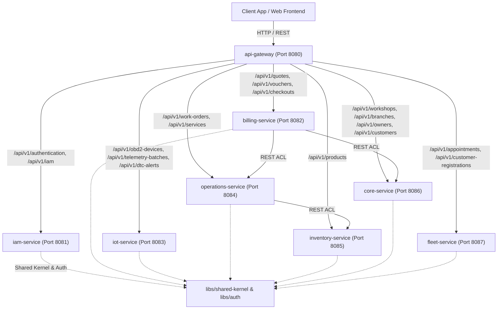

# DriveOS Platform - Microservices Architecture & Deployment Specification

## 1. Monorepo Overview & Service Mapping

DriveOS Platform is structured as a Maven Multi-Module Monorepo using Domain-Driven Design (DDD) principles. The platform consists of shared internal libraries (`libs/`) and 7 independent microservices plus an API Gateway (`apps/`).



---

## 2. Microservice Registry & Endpoints Table

| Module | Service Name | Default Port | Primary Responsibilities & Bounded Contexts |
| :--- | :--- | :--- | :--- |
| `apps/api-gateway` | API Gateway | **8080** | Reverse proxy router for all `/api/v1/**` HTTP endpoints to microservices. |
| `apps/iam-service` | IAM Service | **8081** | Identity and Access Management, User authentication, JWT issuance, Password recovery. |
| `apps/billing-service` | Billing Service | **8082** | Invoicing, Quotes, Vouchers, Facthub SUNAT integration, Payments. |
| `apps/iot-service` | IoT Service | **8083** | OBD2 device management, Telemetry batch ingestion, DTC alert processing, Vehicles. |
| `apps/operations-service` | Operations Service | **8084** | Work Orders, Mechanic task management, Workshop services catalog. |
| `apps/inventory-service` | Inventory Service | **8085** | Products catalog, Product batches, Stock management, Physical inventory deduction. |
| `apps/core-service` | Core Service | **8086** | Profiles, Workshops, Branches, Branch subscriptions, Customers, Employees, Owners. |
| `apps/fleet-service` | Fleet Service | **8087** | Vehicle fleets, Customer registrations, Employee registrations, Appointments. |

---

## 3. Shared Libraries (`libs/`)

- **`libs/shared-kernel`**: Pure domain primitives and value objects (`Result`, `Money`, `BranchId`, `CustomerId`, `VehicleId`, `Mileage`, `Address`, `GlobalExceptionHandler`). Absolutely no domain-specific business logic.
- **`libs/auth`**: Reusable security authentication pipeline (`AuthenticatedUser`, `JwtTokenParser`, `BearerTokenFilter`).

---

## 4. Build & Testing Execution

To build and run all tests across all reactor modules from the repository root:

```bash
./mvnw clean test
```

To run a specific microservice locally:

```bash
./mvnw spring-boot:run -pl apps/iam-service
```
